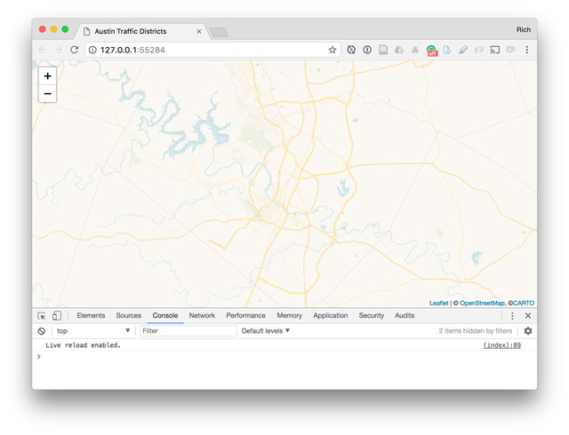
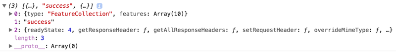
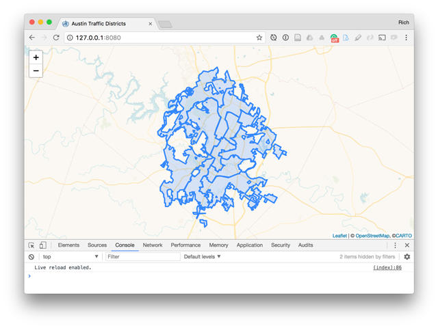
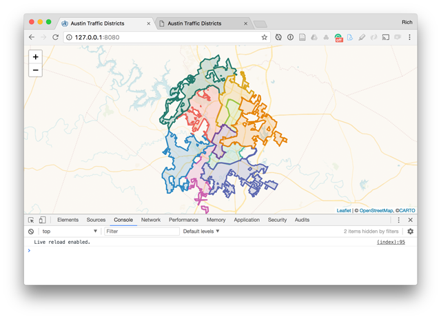
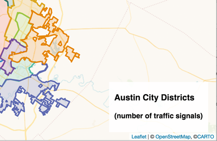
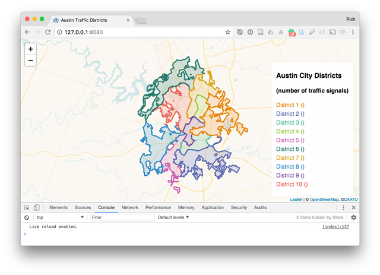
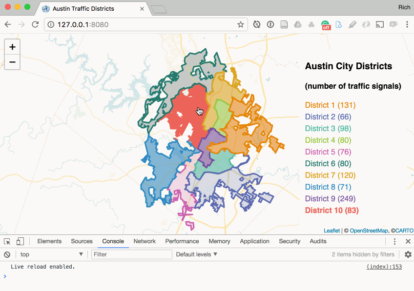
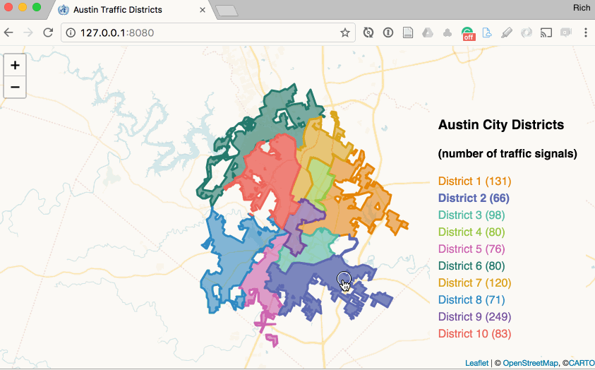
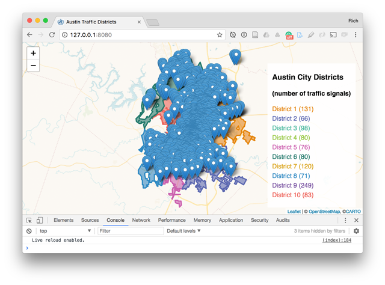
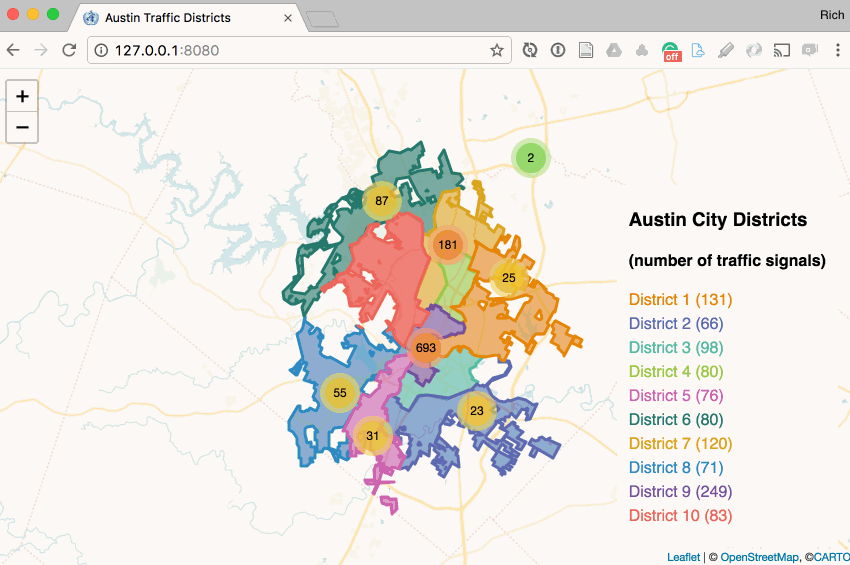

# Assignment 04: Mapping with Node

This assignment consists of two parts. The first you'll do independently and continues the process to integrate the data files we worked within the lesson within a web map demonstrated some very basic coordinated visualization. The second part will ask you to collaboratively find and process new datasets to make a similar map like the one created below.

## TOC

* [Part I. Make a map!](#part-i-make-a-map)
  + [Installing an npm project and running scripts with npm start](#installing-an-npm-project-and-running-scripts-with-npm-start)
  + [Drawing and styling the districts using Vivid color scheme](#drawing-and-styling-the-districts-using-vivid-color-scheme)
  + [Creating a coordinated viz legend](#creating-a-coordinated-viz-legend)
  + [Using the Leaflet.markercluster plugin to deal with too many markers](#using-the-leafletmarkercluster-plugin-to-deal-with-too-many-markers)
* [Part II. Make another map (with a team member!)](#part-ii-make-another-map-with-a-team-member)

## Part I. Make a map!

Begin by examining the contents of the _map675-module-02-username/assignment-04/_ directory. You'll see:

* a _project-files/_ directory containing the source files we processed in the lesson. 
* an _index.html_ file with a basic Leaflet template. If you load this file using live-server (or another local server) in your browser, you'll note that it's simply loading Leaflet map with the CARTO Voyager basemap.
      
    **Figure 01.** Blank Leaflet Map with Voyager basemap tiles.

* a directory named _build-scripts/_ containing four files:
    * _processData.js_ a script which loads the other three files and calls methods from those modules
    * _bindData.js_ a script similar to the one we rehearsed in the lesson which tallies the total count of signals within each district and outputs a new GeoJSON file
    * _colorScheme.js_ which extracts the "Vivid" color scheme from the _cartocolors.json_ file and writes it to a new file
    * _csv2geojson.js_ which converts our CSV file to a GeoJSON file format
* a _libs/Leaflet.markercluster/_ directory containing a Leaflet Plugin used to cluster markers (used at the end of this assignment)

Before we start coding our Leaflet map, we need to process the data files in the _project-files/_ directory in a similar way we did when exploring the command processes in the lesson. Specifically, we want to:

* extract the "Vivid" color scheme from the _cartocolors.json_ file and save this as a _vividcolors.json_ file in the _data/_ directory
* convert the _austin-traffic-signals.csv_ file to a GeoJSON file named _austin-traffic-signals.json_ in the _data/_ directory, removing any unneeded data attribute fields
* use the _austin-traffic-signals.csv_ and _austin-council-districts.json_ files to create a new property within the _austin-council-districts.json_ file of the total count of traffic signals within each district and save this to a file named _district-counts.json_

We also want to simplify the _district-counts.json_ using Mapshaper to remove unnecessary node vertices and coordinate precision.

### Installing an npm project and running scripts with npm start

We treated all these processes separately as we worked our way through the Module 02 lesson. We _could_ simply create a new directory named _data/_ and copy these output files from the lesson material into this directory.

However, we'll instead demonstrate another awesome aspect of npm's power to share and manage a project. We're going to use npm to run a series of commands and scripts to:

1. create the new _data/_ directory
2. process all the data files into the desired output files as detailed above
3. launch live-server to load our Leaflet map in the browser

You may be thinking, "Oh no ... I have to do all that now before making the map!?" Fortunately, you don't have to. All those scripts within the _build-scripts/_ directory are poised and ready to do that for you ... with a single command from the terminal!

How is this possible? Examine the _package.json_ file. You'll see a `"scripts"` property within that file containing a property with a name of `"start"` that looks like this:

```json
"scripts": {
  "start": "node build-scripts/processData.js && live-server"
}
```

The `"scripts"` property within the _package.json_ file allows us to write a series of custom commands that we can execute from the terminal.

But first, we need to initialize our npm project. As we can see, the directory currently contains no _node_modules/_ directory, and therefore the scripts within our _build-scripts/_ directory that use Node would not have access to the necessary modules. Sure, we could install these all individually using the `npm install <package name> -S` command. But we don't need to. Why?

Note how the _package.json_ file contains the `"dependencies"` property listing the Node modules our scripts require:

```json
"dependencies": {
  "chalk": "^2.4.0",
  "csv-parse": "^2.2.0",
  "csv2geojson": "^5.0.2",
  "mapshaper": "^0.4.66"
}
```

If you recall from the lesson, npm automatically added these property values to the _package.json_ file when we installed them one at a time. You may have thought this was merely a cute way of keeping track of what npm modules we added, but the utility of the `"dependencies"` property extends beyond that.

We can create the _node\_modules/_ directory and install all our necessary modules with a single command. Run this command from the root level of your map675-assignment-04-_username_ directory:

```bash
npm install
```

Like magic, npm reads the _package.json_ file's `"dependencies"` property values and installs all the required modules. You may see some warnings (which you can ignore for now). But npm output in the terminal should inform you that it's installed 33 packages and created a _lockfile.json_ file:

```bash
$ npm install
npm WARN deprecated sexagesimal@0.5.0: This module is now under the @mapbox namespace: install @mapbox/sexagesimal instead
npm notice created a lockfile as package-lock.json. You should commit this file.
npm WARN assignment-04@1.0.0 No repository field.

added 33 packages in 2.113s
```

You can also go ahead and commit this installation with Git (and you should be adding/commit substantive changes with Git as you proceed through this assignment):

```bash
git add .
git commit -m "install npm project"
```

Next, run the following command from your terminal:

```bash
npm start
```

This command is a special one for npm because it knows to run whatever commands  the `"scripts"` property contains that has a name of `"start"`, within the _package.json_ file.

Running this command should accomplish the following two commands, as dictated by the value of the `"scripts"` property:

* `node build-scripts/processData.js`
* `live-server`

The first one will invoke node to run the _processData.js_ script and the second will launch the live-server module (provided it's installed globally on our system as suggested within the Assignment 03 lesson). We won't substantially explain how the build-scripts all work to do this using what's known as [CommonJS exports](https://webpack.github.io/docs/commonjs.html), but feel free to get curious and read about it! The bottom line is that the _processData.js_ file imports functions from the other three scripts and executes the desired geocomputation.

The output in the terminal will look something like this:

```bash
$ npm start

> assignment-04@1.0.0 start /Users/NewMaps/Documents/map675-assignment-04-donohue
> node build-scripts/processData.js && live-server

austin-traffic-signals.csv loaded
parsing csv ...
cartocolors.json data loaded!
cartocolors.json data parsed to JSON
vivid scheme extracted from parsed data
austin-traffic-signals.json written to file
vividcolors.json written to data/ dir
districts-counts.json written
http://0.0.0.0:8080 is already in use. Trying another port.
Ready for changes
Serving "/Users/NewMaps/Documents/map675-assignment-04-donohue" at http://127.0.0.1:55284
```

If all went well, you should now have a _data/_ directory containing our desired output files. The live-server should have launched, and the index.html file should be rendered in the browser.

  
**Figure 02.** Blank Leaflet Map with Voyager basemap tiles.

We're now ready to draw our data to the map, apply some coordinated visualization techniques, and deal with too many markers of those traffic signals using a Leaflet plugin named Leaflet.clusterMarker.

This section demonstrated a powerful collaborative aspect of using npm to share projects with other people. Using npm helps to both document and automate processes for future use.

**Task 1:** Loosely comment the four scripts within the _build-scripts_ directory; add, and commit these comments to your repository. You will likely need to search the web for documentation about various elements of the scripts (hint: use the npm or Node when you search). Also, we can all discuss this and post code snippets on the map675 Slack channel (collaboratively) to help better interpret these scripts. Studying and figuring out new code is a valuable practice, and this gives us an opportunity to puzzle it out.

Also, in particular, note the use of the [mapshaper npm package](https://www.npmjs.com/package/mapshaper) in the _build-scripts/bindData.js_ script.

### Drawing and styling the districts using Vivid color scheme

Within the _index.html_ file provided, we can see several lines of code commented out (lines 45 - 55). This code uses JQuery's `.when()` method to asynchronously load our three data files from the _data/_ directory. When the files are loaded, we can access them within the callback function.

**Important to note:** JQuery's `.when()` method loads the data but it doesn't provide a single object within the callback function. If you use a `console.log()` statement to examine the referenced value, you'll see it's an object containing three properties, the first of which is our desired data. For instance, if we `console.log(districts)` directory directly within the callback we'll see the following output in the browser Console:

  
**Figure 03.** JQuery's when callback result.
Provided there were no errors loading the data, we can reassign the value of the properties within the callback to reference only our desired data objects.

Un-comment the lines within the _index.html_ file that load the data:

```javascript
$.when(
  $.getJSON('data/districts-counts.json'),
  $.getJSON('data/vividcolors.json'),
  $.getJSON('data/austin-traffic-signals.json')
).done(function (districts, colors, signals) {

  var districts = districtsData[0],
      colors = colorsData[0],
      signals = signalsData[0];

});
```

Note that if you're not using `console.log()` statements within this callback function to examine what values the parameters are referencing, then you're not curious about what's actually happening with the script and the data. Just saying. :smirk:

We can now add the districts polygons to our Leaflet map quickly with a statement such as:

```javascript
var districts = districtsData[0],
    colors = colorsData[0],
    signals = signalsData[0];

L.geoJson(districts).addTo(map);
```

Which will result in the default Leaflet styles:
  
**Figure 04.** Leaflet map with council district polygons drawn with default styles.

Next, we want to style each polygon with a unique color. We'll use a qualitative color scheme (rather than a quantitative, sequential color scheme) because we're treating these units as categorically distinct.

Now consider the following changes to the script, using the L.geoJson() `style` option:

```javascript
// create a layerGroup with the geojson data
var districtsLayerGroup = L.geoJson(districts, {
  style: function (feature) {
    // use the colors object to style
    // each polygon a unique color
    return {
      color: colors.Vivid[10][feature.properties.council_di - 1],
      fillOpacity: .6
    }
  }
```

While we could hard-code some color values into a function as we've done in the past, instead we can use the colors object we've loaded into the script from our _vividcolors.json_ file. Each feature of our council districts has a unique id number value (in the properties encoded with the `council_di` property). We can conveniently use this number to access the color values within the `colors` object array containing 10 distinct color values.

You may be thinking about how we've often used JS else/if statements or a switch statement within a new function named `getColor()` or something similar to return a color value and assign it to the style property `color`. This approach illustrates a more eloquent approach using the object literal stored within the color file:

```json
"10":["#E58606","#5D69B1","#52BCA3","#99C945","#CC61B0","#24796C","#DAA51B","#2F8AC4","#764E9F","#ED645A","#A5AA99"]
```

If you're astute, you'll notice that this array actually contains 11 hex color values and not 10. This is because CARTO includes an additional color for an "other" category (`#A5AA99`, which we won't use). It's the last item in the array, which is why we need to begin the zero index of the array.

  
**Figure 05.** Council districts colored with Vivid styles.

We now have basic (but so far useless) thematic map using a qualitative color scheme. Let's make it more fun and useful.

**Task 2:** Add and commit your changes to the project with an appropriate message (it's fine if you've been making other commits as well).

### Creating a coordinated viz legend

Any good map requires a legend. We're going to build one dynamically using the Vivid color scheme we've created. Furthermore, we're going to implement what's known as "coordinated visualization," which refers to linking different data graphics so that interaction with one triggers changes or affordances in another. Obviously, a textual legend isn't the most robust of infographics, but this basic example will demonstrate the conceptual and technical aspects.

We can first create a new DOM element by writing HTML to hold our legend:

```html
<div id="map"></div>
<div id="ui">
    <h3>Austin City Districts</h3>
    <h4>(number of traffic signals)</h4>
    <ul id="legend-list"></ul>
</div>
```

Of course, when we create HTML elements we often want some CSS rules to select those elements and apply styles. Note here we'll include some CSS rules for the `<li>` and `<a>` elements that we'll be generating dynamically with the JavaScript, as well as a `.highlight` class which we can apply to elements for interactively-triggered affordances.

```css
#ui {
    position: absolute;
    z-index: 1000; /* place above map */
    bottom: 18px;
    right: 18px;
    padding: 6px 12px;
    background: rgba(256,256,256,.9);
}

#ui ul {
    list-style-type: none;
    padding: 0;
}
#ui li {
    margin-bottom: 6px;
}
#ui a {
    text-decoration: none;
}
#ui a:hover {
    font-weight: bold;
}
.highlight {
    font-weight: bold;
}
```

These additions will produce a static element on the page that will hold our legend.

  
**Figure 06.** Static legend container ready for dynamic elements.

Next, before we create the `districtsLayerGroup` and add it to the map, we can:

1. Select our empty legend list
2. Loop through our districts features
3. For each feature, append a new list item (`<li>`), giving each a common class attribute (`class="legend-item"`) and a unique id attribute using the iterating number that refers to each polygon (`d="district-' + i + '"`). We'll place the text for each within `<a>` tags and style them using the Vivid color scheme in a similar way as we did when coloring the polygons.

```javascript
var districts = districtsData[0],
    colors = colorsData[0],
    signals = signalsData[0];

// store a reference to the HTML list
var legendList = $('#legend-list');

// loop through the features and create a new
// list item for each feature in the legend
for(var i = 1; i <= districts.features.length; i++) {
    legendList.append('<li class="legend-item" id="district-' + i + '"><a style="color:' + colors.Vivid[10][i -1] + '" href="#">District ' + i + ' (<span></span>)</a></li>');
}
```

Adding this JavaScript should produce a legend color-coded to match the polygons. Note that we've included some still empty parentheses enclosing empty span tags.

  
**Figure 07.** Static legend container containing feature names.

Next, we can add an `onEachFeature` option to our L.geoJson() constructor to achieve the following:

1. select each `<span>` tag within our legend to update the total number of counts for each feature
2. apply a `mouseover` and `mouseout` event to each layer to:
    * provide a visual affordance on the map polygon changing the `fillOpacity` style property
    * select the corresponding list item and add/remove the `highlight` class we defined in the CSS

Here I've included the entire structure:

```javascript
// create a layerGroup with the geojson data
var districtsLayerGroup = L.geoJson(districts, {
  style: function (feature) {
    // use the colors object to style
    // each polygon a unique color
    return {
      color: colors.Vivid[10][feature.properties.council_di - 1],
      fillOpacity: .6
    }
  },
  onEachFeature(feature, layer) {
    // select each legend list item span and append the total count of signals
    $('#district-' + feature.properties.council_di + ' span').append(feature.properties.count);

    //when mousing over a polygon layer
    layer.on('mouseover', function () {
      // provide a visual affordance
      this.setStyle({
        fillOpacity: .8
      });

      // select the cooresponding list item
      // and add the highlight class to make bold
      $('#district-' + feature.properties.council_di).addClass('highlight');
    })
  }
}).addTo(map);.addTo(map);
```

The result should now give us a map that when we mouse over polygons:

1. adjusts the fill opacity of the polygons
2. adds the `highlight` class to the corresponding list item in the legend

Additionally, the CSS `a:hover` rule applies the same style rule as the `highlight` class (it's best to keep these affordances consistent).

  
**Figure 08.** Mousing over polygons also highlights corresponding legend item.

Finally, we want the coordinated visualization to be complete by having the interaction work both ways. In other words, we want the user to be able to mouse over the legend items and trigger the corresponding polygon affordance.

Including the following code block beneath the `L.geoJson()` structure will achieve this. The comments included help explain how we use JavaScript to achieve this:

```javascript
// select all the list items and on mouseover
$('.legend-item').on('mouseover', function() {
    // extract the specific number from the specific item
    // being moused over
    var num = this.id.replace('district-', '');
    // send this number as an argument to the highlightDistrict function
    highlightDistrict(num);
});

function highlightDistrict(districtNum) {
    // loop through the districts polygons
    districtsLayerGroup.eachLayer(function(layer) {
        // if the district id matches the one we're mousing over
        if(layer.feature.properties.council_di === districtNum) {
            // change the layer style
            layer.setStyle({
                fillOpacity: .8
            }).bringToFront();
        } else {
            // return to original
            layer.setStyle({
                fillOpacity: .6
            });
        }
    });
}
```

Note that we've included all of this code within the callback function of the `.done(function(districts, colors, signals) { }` method when we loaded our data files. You could certainly send the loaded data into a new function. For simplicity, I've kept it within this callback for these instructions.

The result should now be a fully interactive coordinated visualization between the map and the legend:

  
**Figure 09.** Fully interactive coordinated visualization between the map and the legend.

This concludes the coordinated visualization aspect of the map.

**Challenge:** Modify the existing code so that when the user clicks on a legend element, the map zooms to the bounds of the selected district.

Let's now move on to deal with all the actual point locations of the traffic signals.

**Task 3:** Add and commit your changes to the project with an appropriate message (it's fine if you've been making other commits as well).

### Using the Leaflet.markercluster plugin to deal with too many markers

Try plotting the point data with the default `L.geoJson()` method:

```javascript
L.geoJson(signals).addTo(map);
```

We get a map overrun with markers:

  
**Figure 10.** Map has too many cluttered markers.

We have various ways of dealing with this. We could convert the markers to small `L.circle()` or `L.circleMarkers()` circles, which may help a little bit. Of course, when the user zooms the map in the markers become more visually dispersed.

But we're going to use a Leaflet Plugin named [Leaflet.markercluster](https://github.com/Leaflet/Leaflet.markercluster) to help solve our problem.

You'll notice that the starter directory for the assignment included a directory named _libs/Leaflet.markercluster/_, which contains three files:

* _leaflet.markercluster.js_
* _MarkerCluster.css_
* _MarkerCluster.Deafult.css_

These are the files the Plugin uses to do the marker clustering, and they're found in the _dist/_ directory of the Plugin's GitHub repository: https://github.com/Leaflet/Leaflet.markercluster/tree/master/dist

Often when you want to use an external Plugin, you should download and use the files with the _dist/_ directory (short for "distribution").

Rather than using a remote CDN, we've saved these files to our local source files and need to update our HTML document to load them on page load. So, include the CSS files in the head of your document:

```html
<title>Austin Traffic Districts</title>
<link rel="stylesheet" href="https://unpkg.com/leaflet@1.3.1/dist/leaflet.css" />
<link rel="stylesheet" href="libs/Leaflet.markercluster/MarkerCluster.Default.css"> />
<link rel="stylesheet" href="libs/Leaflet.markercluster/MarkerCluster.css"> />
```

And the JavaScript file toward the bottom but before our custom `<script></script>` tags:

```javascript
<script src="https://code.jquery.com/jquery-3.3.1.min.js"></script>
<script src="https://unpkg.com/leaflet@1.3.1/dist/leaflet.js"></script>
<script src="libs/Leaflet.markercluster/leaflet.markercluster.js"></script>

<script>
   // custom JS here
</script>
```

Note that we've used relative paths to the `libs/Leaflet.markercluster` directory from the _index.html_ file.

Next, toward the bottom of our custom script (but before the end of the `.done()` method's callback function) we can replace the `L.geoJson(signals).addTo(map);` with the following script:

```javascript
// create new markerClusterGroup
var markers = L.markerClusterGroup();

// loop through all our signals features
signals.features.forEach(function(feature) {
  // create a new Leaflet marker for each
  var coords = feature.geometry.coordinates,
      marker = L.marker([coords[1], coords[0]]);
  // bind a tooltip to the marker
  marker.bindTooltip("Signal ID: " + feature.properties.SIGNAL_ID);
  // add the marker to the markerClusterGroup
  markers.addLayer(marker);

});
// add the markerClusterGroup to the map
map.addLayer(markers);
```

The comments within help explain what's happening. We build new markers manually from the signals' feature geometry coordinates (note that we're using lng/lat and not lat/lng ordering) and add them to a `L.markerClusterGroup()` object, which we create with the help of the Plugin code we added. Once all the markers are added to the `markerClusterGroup()`, we add that `markerClusterGroup()` to the map.

The result is the following map: 


**Figure 11.** Markers applied using the Leaflet.markercluster Plugin.

Note how when you zoom into the map, the clusters disaggregate to smaller clusters and eventually show the specific marker locations. The nice thing about the clusters is that when the user hovers over them, the Plugin shows the actual extent of markers represented by the aggregated larger circle.

Also know that all visual aspects of the larger clusters, the total count shown within, the bounding box, and individual markers can be styled with customized styles (particularly within the _MarkerCluster.Default.css_ file).

**Part I. Deliverable (4pts):** After completing the preceding sequence of design and development operations, and committing changes using Git along the way, push the _map675-module-02-_username_ to the remote repository on the newmapsplus GitHub account by the due date.

## Part II. Make another map with a team member!

Part II of the assignment challenges you and an assigned team member to use techniques explored within the Module 02 lesson and the first part of Assignment 04 above to create a new project with a new dataset that meets the following requirements.

### Requirements

* A Github-hosted and npm initialized project containing:
    * a _package.json_ file documenting the npm modules used to process data
    * original, pre-processed data files, saved within a _project-files/_ directory (although try to limit the number and size of Shapefiles and **don't attempt to add/commit and push any files larger than 100MB to GitHub** and/or add such files to the _.gitignore_ file)
    * any Node scripts written to process the data, saved with a _scripts/_ directory
    * terminal or commands used when data processing (such as using Mapshaper's global package) documented in the README.md file
        * Note that you have access to the history of the terminal commands issued on a system ([command history in OS X](https://www.howtogeek.com/298163/how-to-use-your-command-history-in-the-windows-command-prompt/), [windows command history](https://www.howtogeek.com/298163/how-to-use-your-command-history-in-the-windows-command-prompt/)).
* A web map displaying:
    * areal (polygon) features colored thematically (either qualitative or quantitative) using colors extracted from _cartocolors.json_.
    * an overlay of point features utilizing the Leaflet.markercluster plugin
    * an appropriate title, legend, meta data (link to source, etc.)

Consider this more of an alpha prototype map (don't worry about finely polishing or adding a lot of bells and whistles, unless you're so inclined). Also, feel courageous and [explore other npm packages](https://www.npmjs.com/npm/). Try your hand at writing a new Node script or improving upon one of the scripts offered in the assignment above.

Collaboration in web mapping means following your curiosity and offering the value of your labor to your shared community.

The assignment notification from Canvas will assign team members and indicate which team member should create a new repository on their remote personal GitHub account to start the project.

To begin, one team member should:

* initialize the project on a new Git repository hosted GitHub account:
    * check the box that says "Initialize this repository with a README"
    * "Add .gitignore" and choose "Node"
    * clone the repo down to their local machine
    * initialize npm to create the _package.json_ file on the master branch (i.e., `npm init`)
    * add/commit/push these changes back up to the remote
* then:    
    * add your team member's GitHub username under Settings > Collaborators
    * add your instructor's GitHub username (rgdonohue) under Settings > Collaborators so he can help out and monitor your progress throughout the week

* the other team member should then clone down the repository (which has been initialized with npm)
* both team members should then:
    * start discussing and looking for potential datasets to map (quickly!)
    * make a plan for dividing up labor to:
        * process the source data into suitable formats for the web map (remember to record your process within Node scripts and/or terminal commands recorded within the README.md file)
        * build the structure of the HTML within a _index.html_ file
        * write JavaScript and CSS to make the map functional and beautiful (or at least a rough prototype of a map similar to the example map built in Part I).

Mastering the command line and using Node and npm is challenging and complicated. It's okay to be confused and frustrated at first. Communication with each other and your instructor is the key. And most importantly, have fun with it! We're just making maps, not doing brain surgery.

**Part II Deliverable (6pts):** Provide a link to the GitHub repository housing your new map project by the due date. Also be sure to enable the GitHub Pages for the master branch so we can view your rendered map.